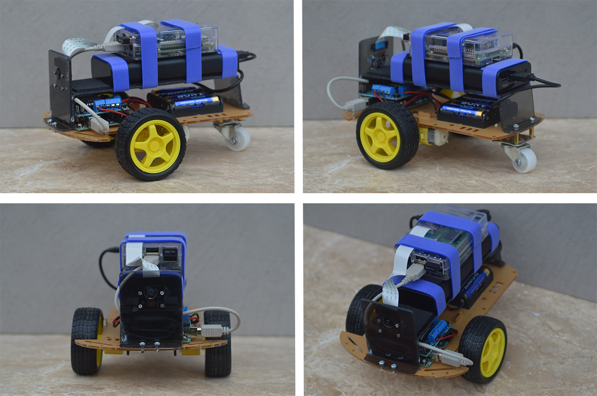
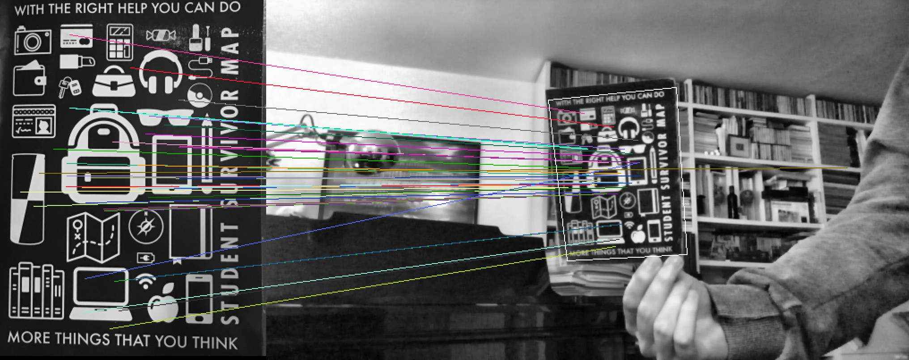
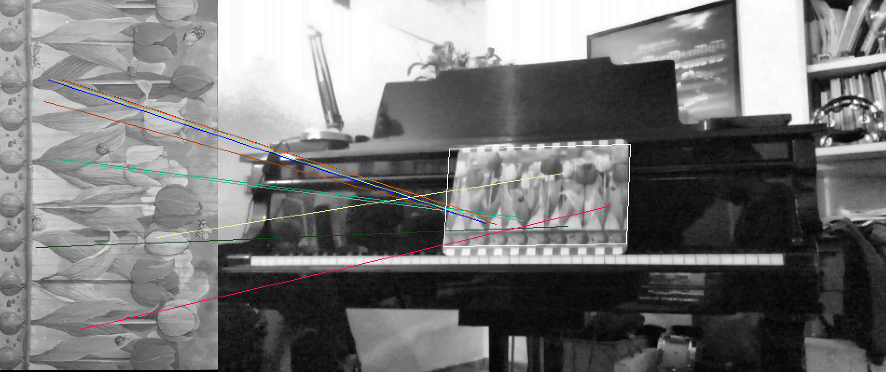
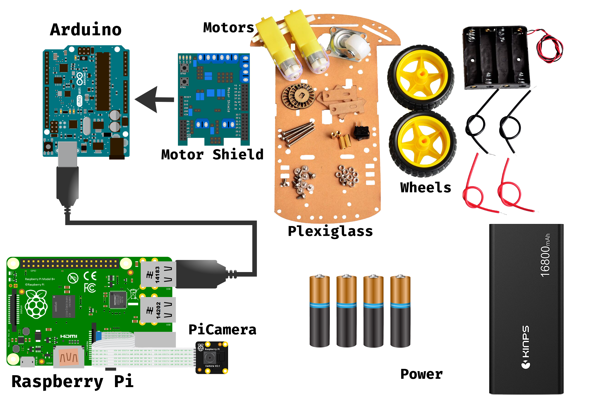

# TheHound

## Introduction

This is an autonomous system capable of recognizing and follow arbitrary objects in the space surrounding the system, using modern embedded technologies and computer vision techniques.

The system is of small dimension , low energy consumption and reduced production costs. The small dimension allow the system to be autonomous and to be integrated in more complex projects, making it, at the same time, easily transportable and of simple usage.
A long autonomy is fundamental for a continuous and intensive usage, in fact, a lot of attention was directed to energy consumption.

Finally the reduced costs make this system a platform accessible to many more users than many production systems available on the market.

From a single input image, representing an object, the system is capable of extracting the necessary information for the following elaboration of a continuous stream of images captured from the integrated frontal camera. With the results of this elaboration the system can estimate and predict the position of the object (if present) in the surrounding space and operate the supplied actuators to track and follow the object.

## Construction

The System has been built using the materials and hardware specified in the [Requirements section](#requirements).

- The wheels, motors and the battery case are mounted on the plexiglass base. The Arduino is also mounted on the base and fixed with 4 plastic screws.
- The motors should be connected and soldered to the shield. The switch and battely case shoud be connected as well.
- On top of the base a custom plexiglass structure is mounted. This can sustain the PiCamera, The RaspberryPi and the big battery.
- The AA batteries will power the Arduino, the shield and the motors, the big battery will power the RaspberryPi.
- The Arduino needs to be connected through a USB cable to the RaspberryPi.
- The PiCamera needs to be connected to the RaspberryPi.
- If the RaspberryPi is a v2 then it will need a WiFi Adapter.
- Finally tie all toghether using some straps.

The final result should look like the [initial picture](./Images/CarPhoto.png) of the system.

## Usage

Assemble the System and load the relative software onto the devices.

Then:

1. Connect the iPhone and the RaspberryPi to the same WiFi Network (It can also be the WiFi Hotspot from the smartphone)
2. Through ssh connect to the RaspberryPi and launch one of the scripts:
    - `Tesi.py` for the tracking functionality: `$ python3 Tesi.py`
    - `RemoteControl2.0.py` for just the remote control: `$ python3 RemoteControl2.0.py`
3. Open the relative iPhone app:
    - CVClient for `Tesi.py`
    - Remote for `RemoteControl2.0.py`
4. Just use the iPhone app to controll the Device.

## The workflow

After all the devices are tourned on and all the software has been loaded and started, the RaspberryPi script (`Tesi.py`), waits for the iPhone to connect and then to send the first image representing the object to follow.

The script then proceeds to the Image Elaboration to detect and store relevant features of the object to use later to match with features extracted from the continuous stream of images from the PiCamera.

The feature extraction algorithm used is called SURF (Speeded up Robust Features) which is invariant to rotations, scale changes and minimal tilting (See below examples). (See code and Thesis for more details)

Then the script collects images from the PiCamera and tries to match similar features between the current frame image and the original image from the iPhone.

If enough matches with high confidence are found then the object is projected onto the current frame through an omography.

Then the spatial position of the object is estimated and sent through serial connection (formatted as a JSON) to the Arduino.

The Arduino then calculates the necessary moves to get to the object and actuates the motors accordingly.

This process is repeated constantly adjusting the estimates frame by frame.

While this is happening, in an other thread the script sends back the results of the elaboration to the iPhone which shows them onto the screen for the user to see.

Some examples of the results of the elaboration:

(Again more details can be found in the Bachelor Thesis and in the code).

## Bachelor Thesis

A very detailed description of the project is available in the `Tesi Luca Angioloni.pdf` file (but in italian).

This is my Bachelor Degree Thesis.

## Requirements

### Hardware & Materials
- An Arduino Uno
- A RaspberryPi (v2 or v3)
- An iPhone (to control it otherwise it can work also on his own using ssh and a terminal)

And this material:

### Software

#### Arduino

| Library        | Verison        |
| -------------- |:--------------:|
|**ArduinoJson** |    >= 5.8.0    |
|**AFMotor**     |    >= 1.0.0    |

#### RaspberryPi

Any Debian based OS distribution should be fine.

| Software       | Verison        |
| -------------- |:--------------:|
| **Python**     |     >= 3.5     |
| **OpenCV**     |    == 3.1.0    |
| **Numpy**      |    >= v1.10    |
| **picamera**   |    >= 1.10     |
| **serial**     |    >= 0.0.20   |

#### iPhone

| Software       | Verison        |
| -------------- |:--------------:|
| **iOS**        |    >= iOS 10   |
| **Swift**      |   >= Swift 3   |

## License

Licensed under the term of [MIT License](http://en.wikipedia.org/wiki/MIT_License). See attached file LICENSE.
